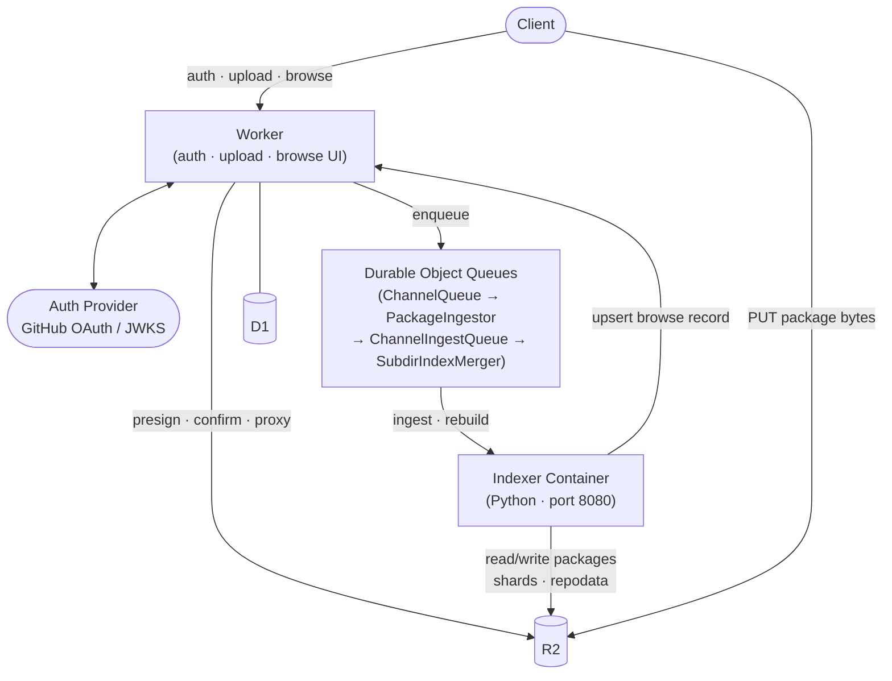

# conda-wit

> **Proof of concept — no stability guarantees.**
> This project is under active development and is not yet production-ready.
> APIs, storage layouts, and configuration may change without notice.
> Use at your own risk.

Lightweight conda channel server: R2 for storage, one Cloudflare Worker for auth, upload
orchestration, and a browse UI; one Cloudflare Container running the indexer that wakes on
upload and sleeps 2 min after going idle.
Accepts both `.conda` (current format) and legacy `.tar.bz2` packages.
`conda_package_streaming` extracts metadata from either uniformly.
`conda-index` is present in the container image but is **never called by the hot
path** — uploads and deletes both mutate the content-addressed shards directly
(see [Note on conda-index](#note-on-conda-index)).

## Architecture



## Source layout

```
src/
  worker.ts                   # entrypoint — URL router + DO exports
  types.ts                    # shared Env + row interfaces
  utils.ts                    # b64url, HMAC helpers
  browse/
    pages.ts                  # all full-page and HTMX-partial handlers
    render.ts                 # package-list card rendering
    ui.ts                     # CSS constants, FOOTER_HTML, FAVICON_TAGS
  do/
    channel-queue.ts          # ChannelQueue DO
    channel-ingest-queue.ts   # ChannelIngestQueue DO
    package-ingestor.ts       # PackageIngestor DO
    subdir-index-merger.ts    # SubdirIndexMerger DO
  handlers/
    auth.ts                   # device flow, browser OAuth (PKCE), OIDC exchange
    channel.ts                # channel CRUD, access control
    upload.ts                 # presign + complete
    internal.ts               # container callbacks, admin ops
    trusted-publishers.ts     # OIDC trusted-publisher CRUD
    admin.ts                  # admin page + rebuild-browse trigger

container/
  Dockerfile                  # debian:bookworm-slim + pixi
  entrypoint.py               # Python HTTP server (port 8080)
  pixi.toml                   # Python deps (conda-index, conda_package_streaming, boto3, …)
```

## Setup

### 1. Create the R2 bucket

```bash
wrangler r2 bucket create conda-wit
```

Edit `R2_BUCKET_NAME` in `wrangler.toml` `[vars]` first if you want a different name.

### 2. Create a D1 database

```bash
wrangler d1 create conda-channel-meta
```

Paste the returned `database_id` into `wrangler.toml` under `[[d1_databases]]`.

### 3. Create a GitHub OAuth App

Go to **github.com → Settings → Developer settings → OAuth Apps → New OAuth App**.
Enable **Device Flow** (checkbox in the app settings). You need:

- `Client ID` — passed as `GITHUB_CLIENT_ID`
- `Client Secret` — passed as `GITHUB_CLIENT_SECRET` (needed for the browser OAuth flow)

### 4. Create an R2 API token

**Cloudflare dashboard → R2 → Manage API Tokens → Create API Token** (read + write on the
bucket above). This gives you S3-compatible credentials: Access Key ID, Secret Access Key,
and your R2 Account ID.

### 5. Set secrets

```bash
wrangler secret put GITHUB_CLIENT_ID       # OAuth App client ID
wrangler secret put GITHUB_CLIENT_SECRET   # OAuth App client secret (browser login)
wrangler secret put GITHUB_ORG             # GitHub org — upload access is gated on membership
wrangler secret put UPLOAD_TOKEN_SECRET    # any random 32+ byte string: openssl rand -hex 32
wrangler secret put INTERNAL_SECRET        # shared secret between Worker and container
wrangler secret put R2_ACCESS_KEY_ID
wrangler secret put R2_SECRET_ACCESS_KEY
wrangler secret put R2_ACCOUNT_ID
```

`R2_BUCKET_NAME` is not sensitive and lives in `wrangler.toml [vars]`.

**The container receives the R2 credentials and `INTERNAL_SECRET` automatically** — not via
any `wrangler.toml` container config block, but through the `envVars` field on the
`IndexerContainer` class in `src/worker.ts`, which reads from the Worker's own `env` at
module load time:

```ts
import { env } from "cloudflare:workers";

export class IndexerContainer extends Container<Env> {
  defaultPort = 8080;
  sleepAfter = "2m";
  envVars = {
    R2_ACCOUNT_ID:       env.R2_ACCOUNT_ID,
    R2_ACCESS_KEY_ID:    env.R2_ACCESS_KEY_ID,
    R2_SECRET_ACCESS_KEY: env.R2_SECRET_ACCESS_KEY,
    R2_BUCKET_NAME:      env.R2_BUCKET_NAME,
    WORKER_URL:          "https://conda.matt-kramer.com",
    INTERNAL_SECRET:     env.INTERNAL_SECRET,
  };
}
```

### 6. Install dependencies and deploy

```bash
npm install
wrangler deploy   # also builds and pushes the container image — Docker must be running
```

For local iteration, copy `.dev.vars.example` to `.dev.vars` and fill in real values.
`.dev.vars` is gitignored; never commit real values.

## Upload flow (step by step)

```
Client                         Worker                    R2          DOs              Container
  │                              │                        │            │                  │
  │─ POST /auth/device/start ───►│                        │            │                  │
  │◄── {user_code, verify_url} ──│  (proxies GitHub)      │            │                  │
  │  [user approves in browser]  │                        │            │                  │
  │─ POST /auth/device/poll ────►│                        │            │                  │
  │◄── {upload_token} (HMAC) ───│  (1 hr TTL)            │            │                  │
  │                              │                        │            │                  │
  │─ POST /upload/init ─────────►│                        │            │                  │
  │                              │── SigV4 presign ──────►│            │                  │
  │◄── {upload_url} ────────────│  (15 min, no bytes)    │            │                  │
  │                              │                        │            │                  │
  │─ PUT <bytes> ───────────────────────────────────────►│            │                  │
  │                              │                        │            │                  │
  │─ POST /upload/complete ─────►│                        │            │                  │
  │                              │── HEAD (confirm) ─────►│            │                  │
  │                              │── enqueue ─────────────────────────►│ ChannelQueue     │
  │◄── 202 Accepted ────────────│                        │            │  (~5s alarm)      │
  │                              │                        │            │                  │
  │                              │                        │    alarm fires               │
  │                              │                        │    fan-out ──────────────────►│ PackageIngestor
  │                              │                        │            │◄── relay ────────►│ ChannelIngestQueue
  │                              │                        │            │  (one at a time)  │
  │                              │                        │            │─ /ingest-package ►│
  │                              │                        │◄────────── download staged ───│
  │                              │                        │◄────────── write shard+pkg ───│
  │                              │◄─ POST /internal/upsert-package ──────────────────────│
  │                              │── write D1 ───────────────────────►│                  │
  │                              │                        │            │◄── notify SIM ───│
  │                              │                        │            │  (~3s alarm)      │
  │                              │                        │            │─ /rebuild-index ─►│
  │                              │                        │◄────────── read shards ───────│
  │                              │                        │◄────────── write repodata ────│
```

### Auth alternatives

| Method | When to use | Endpoint |
|---|---|---|
| **Device flow** | CLI / headless | `POST /auth/device/start` + `POST /auth/device/poll` |
| **Browser OAuth** | Web UI login | `GET /auth/login` → GitHub callback → session cookie |
| **GitHub Actions OIDC** | CI pipelines — no stored secrets | `POST /upload/exchange-oidc` |

OIDC tokens are validated against GitHub's public JWKS (RS256) and matched against
per-channel trusted-publisher rules stored in D1. A matched OIDC exchange mints a
scoped 15-minute upload token. Manage trusted publishers via the channel admin page
(`/channels/<owner>/<channel>/admin`) or the REST API.

## Durable Object roles

Five DOs collaborate to make the ingest pipeline serialised, batched, and crash-safe:

| DO | Binding | Instance key | Role |
|---|---|---|---|
| `IndexerContainer` | `INDEXER` | `{channel}`, `{channel}/{subdir}/_merge`, `{channel}/_rebuild-browse` | Cloudflare Containers wrapper — the actual Python process |
| `ChannelQueue` | `QUEUE` | one per channel | Debounces uploads (~5s window), owns `owner`/`visibility` state, handles channel claim |
| `PackageIngestor` | `INGESTOR` | `{channel}/{filename}` | Thin fan-out relay — lets `ChannelQueue` await multiple dispatches in parallel without coupling to `ChannelIngestQueue` |
| `ChannelIngestQueue` | `INGEST_QUEUE` | one per channel | Serialises container `/ingest-package` calls (one at a time), retries with back-off on failure |
| `SubdirIndexMerger` | `MERGER` | `{channel}/{subdir}` | Debounces `rebuild-index` calls (~3s), coalesces concurrent package ingests into a single rebuild |

## Container endpoints

The container (`entrypoint.py`) is a plain Python `http.server.HTTPServer` on port 8080.
All endpoints accept and return JSON.

| Endpoint | Caller | Description |
|---|---|---|
| `POST /ingest-package` | `ChannelIngestQueue` alarm | **Hot path.** Download staged package → extract metadata via `conda_package_streaming` → read-modify-write CEP-16 shard in R2 → move to final location → delete staging → call back to Worker D1. Returns `{filename, name, subdir, new_hash, old_hash}`. |
| `POST /rebuild-index` | `SubdirIndexMerger` alarm | Reads all `_shardptr/<name>` pointers → assembles `repodata_shards.msgpack.zst` (CEP-16) + `repodata.json` from existing shards. **No package downloads, no conda-index.** Returns `202` immediately; runs in a background thread to avoid Worker fetch timeouts on large subdirs. |
| `POST /rebuild-browse` | Admin / reconcile | Scans all `repodata.json` files across subdirs → writes per-name `_browse/<name>.json` → rebuilds the browse index. Used for backfill/reconciliation. |
| `POST /delete-package` | Worker delete handler | Prune one build from its package shard (`{channel}/{subdir}/_shardptr/<name>`), deleting the shard + pointer when the last build goes away; returns `{removed, empty, name}` so the Worker can reconcile the browse record and D1. **No downloads, no `conda-index`** — runs in milliseconds once the container is warm. |
| `POST /extract-metadata` | Internal | Download package → extract metadata → return repodata entry dict. Does **not** write anything. |
| `POST /reindex` | Manual recovery only | Legacy: download all packages + cache.db → run `conda-index` subprocess → upload results. Kept for backwards compatibility; normal deletes no longer use it. |

## Delete flow (single package)

`DELETE /channel/{channel}/{subdir}/{filename}?name={package_name}` — owner only
(Bearer upload token or session cookie):

1. The Worker deletes the package object from R2 (`{channel}/{subdir}/{filename}`).
2. `{channel}`'s container is woken and prunes the build from its content-addressed
   shard — the same structure uploads maintain, so deleting one build never requires
   re-scanning the subdir.
3. If that was the last build of the name in the subdir, the Worker drops the subdir
   from the channel-level `_browse/<name>.json` record (deleting the record + the D1
   `packages` row if no builds remain anywhere).
4. `SubdirIndexMerger` is notified and regenerates `repodata.json` + `repodata_shards`
   from the remaining shards on its debounced alarm.

The browser Delete button on the package detail page drives this endpoint. The
`scripts/channel_manager.py delete` command drives the same API.

## Bulk channel delete (cleanup)

`DELETE /channel/{channel}` — owner only (Bearer token or cookie). Wipes everything
for one channel: every R2 object under `{channel}/` (packages, shards, repodata,
`_browse`, `_incoming`), the D1 `channels`/`packages`/`trusted_publishers` rows, and
the per-channel `ChannelQueue`/`ChannelIngestQueue` state. The container instance is
stopped if running.

```bash
python scripts/channel_manager.py purge --channel <channel> --yes
# or
curl -X DELETE https://conda.matt-kramer.com/channel/<channel> \
  -H "Authorization: Bearer <upload_token>"
```

Superadmins can also delete any R2 prefix (e.g. `old/debug/`) with
`POST /internal/delete-r2-prefix` (`{"prefix": "..."}`) — note this only touches R2;
use the channel endpoint when you want the D1 metadata and queues cleaned up too.

## Atomicity, ordering, batching

- **Atomicity**: a Durable Object never runs two alarm invocations concurrently, and
  `ChannelQueue` is one instance per channel — so there is never more than one ingest
  pipeline active for a given channel at a time. This is Cloudflare's own concurrency
  guarantee, not a lock we built.
- **Ordering**: pending uploads are stored under keys like
  `pending:<zero-padded-timestamp>:<filename>`, so they are already in upload order when
  listed back — no separate sort step.
- **Batching**: the ~5s debounce in `ChannelQueue` coalesces near-simultaneous uploads
  into a single container wake per channel.
- **Partial failure**: `repodata.json` is written last, after all package shards it
  references are durably in R2. A crash mid-rebuild leaves the previous valid
  `repodata.json` in place — the shard-based layout means no package is ever referenced
  before its shard exists.

## R2 bucket layout

```
{channel}/{subdir}/repodata.json
{channel}/{subdir}/repodata_shards.msgpack.zst   ← CEP-16 shard index
{channel}/{subdir}/shards/<sha256>.msgpack.zst   ← one per package name, content-addressed
{channel}/{subdir}/_shardptr/<name>              ← mutable pointer → current shard hash
{channel}/{subdir}/_browse/<name>.json           ← browse UI metadata per package
{channel}/{subdir}/<pkg>.conda
{channel}/{subdir}/<pkg>.tar.bz2
{channel}/{subdir}/.cache/cache.db               ← conda-index cache (deletion path only)
{channel}/_incoming/<filename>                   ← staging area (deleted after ingest)
```

Point conda at a channel with e.g.:
```bash
conda install -c https://conda.matt-kramer.com/repo/main some-pkg
```

## Note on conda-index

`conda-index` is present in the container image but is **never called on the normal
paths**. Uploads extract metadata per-package with `conda_package_streaming` and append
to a content-addressed shard; deleting a package prunes the same shard. Both paths then
have `SubdirIndexMerger` reassemble `repodata.json` and the CEP-16 shard index from the
remaining shards — no package bytes are re-read. The old `conda-index` reindex is kept
only as a manual recovery tool (`POST /reindex`).

Consequence: `patch_instructions.json` and `current_repodata.json` are **not** generated on
the hot path. For private/org channels built from your own packages this is fine; mirroring
conda-forge would require the full reindex path.

## Known gaps / future work

- **No status endpoint**: `POST /upload/complete` returns `202` immediately; indexing is
  async. A `GET /channel/:channel/status` returning `ChannelQueue`'s pending count would
  close this gap.
- **Trusted-publisher OIDC is the recommended CI path**, but normal upload tokens work for
  all clients. If a channel has at least one trusted-publisher rule with `require_trusted=1`,
  normal tokens are rejected for that channel.
- **No bulk deletion or yanking UI** — owners can delete individual files from the package
  detail page, and `DELETE /channel/{channel}` (or `channel_manager.py purge`) wipes a whole
  channel. There is no UI for either yet, and no "yank" (hide without delete).
- **Failed-ingest files accumulate in `_incoming/`** — files that fail validation (e.g.
  corrupt packages) are not retried and not cleaned up automatically; add a periodic sweep
  if needed.
- **`max_instances` on `[[containers]]`** (currently 10, `instance_type = "basic"`) is the
  real throughput ceiling for concurrent active channels, not the per-channel DO queue.
- **No signature/hash verification** beyond what `conda_package_streaming` provides when
  extracting metadata.
- **Cloudflare Containers is fast-moving** — `instance_type` values and plan requirements
  may drift; check current docs before deploying on a new account.
